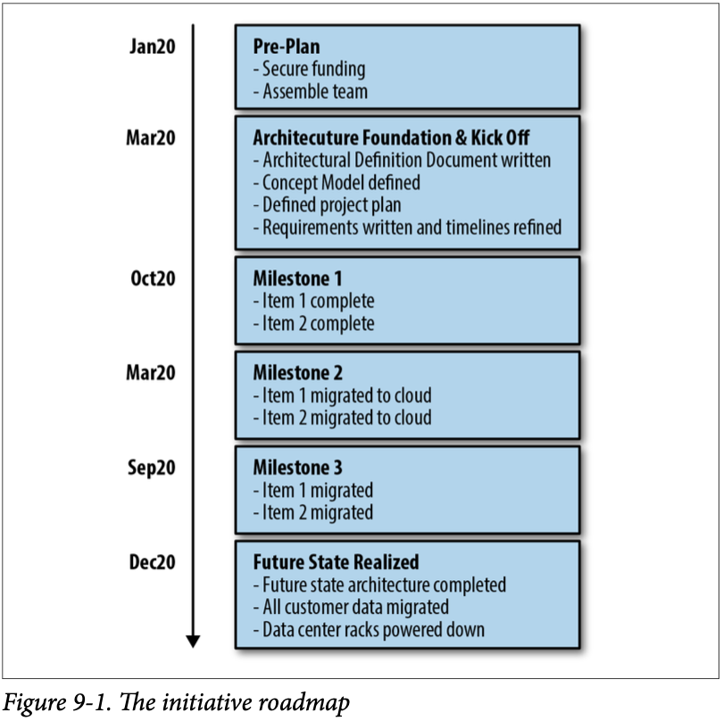

[[section-communicating-strategy-patterns]]
== Communicating the Strategy Patterns

=== Approach Patterns

==== 30-Seconds Answer
==== Rented Brain
==== Ars Rhetorica
==== Fait Accompli
==== Dramatic Structure

Plan:

* Establish the Status Quo
* Create an Inciting Incident
* The Plan
* Shock and Awe

==== Deconstruction
==== Scalable Business Machines

=== Templates

==== One-Slider
==== Use Case Map
==== Directional Costing
==== Priority Map
==== Technology Radar

Further reading: https://www.thoughtworks.com/radar

==== Build/Buy/Partner
==== Due Diligence
==== Architecture Definition

=== Decks

==== Ghost Deck

Here’s how you do it:

1. Make an outline on a whiteboard or some nondeck surface. You need to stay at surface level and go one inch deep across the whole football field first.
2. Write only the headline for all the slides in the deck. Look at them to make sure they still make sense. Back in composition
254 | Chapter 9: Decks
class, we all called this the “topic sentence”—it’s the claim you’re making. Make sure the headlines have rhetorical punch.
3. Once you’ve written all the headlines, review them, making sure they are impactful, make a bold claim, and build together, as we learned in “Dramatic Structure” on page 179 and “Ars Rhetor‐ ica” on page 167.
4. Now you can assign someone to go get the research and write up the actual content in stages, make the charts and graphs, and write up the bullet points that prove the headline.
5. Have that helper send you the work in stages for frequent shoul‐ der checks and revisions (or maybe it’s you playing both roles, and that’s fine too).

==== Ask Deck
==== Strategy Deck
==== Roadmap

==== Tactical Plan
