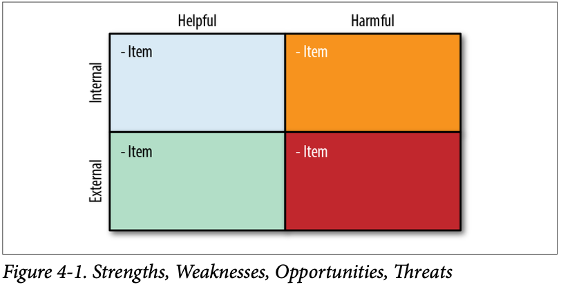
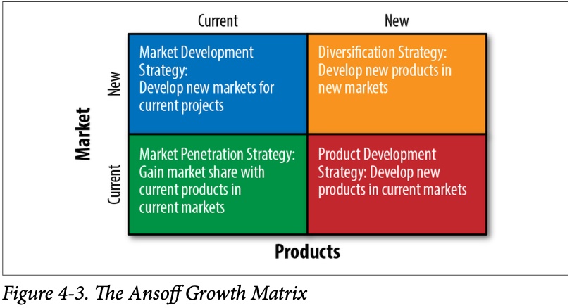
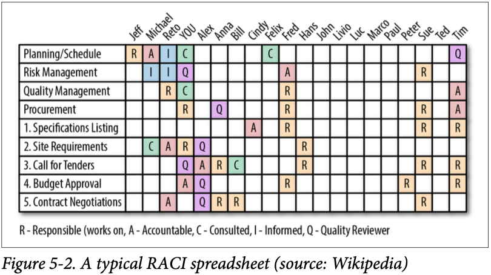
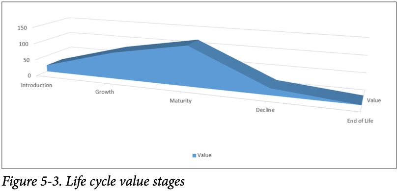
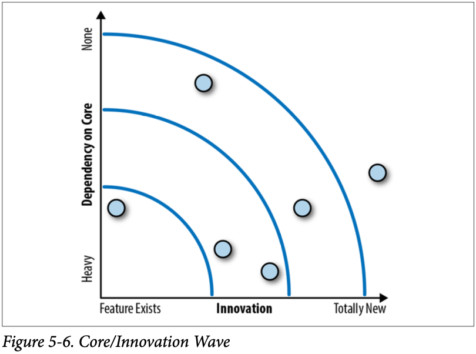
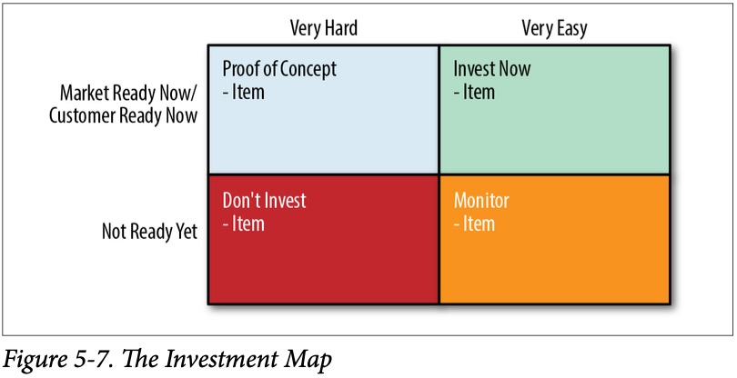
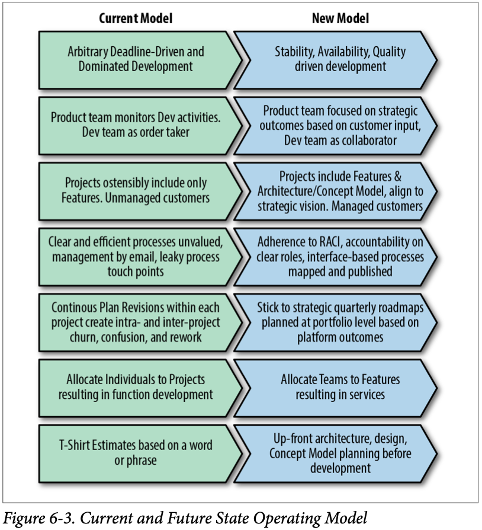
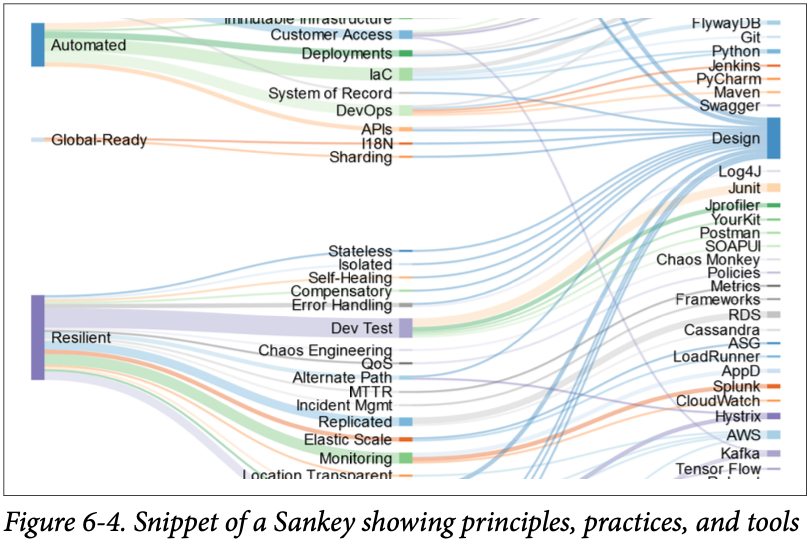
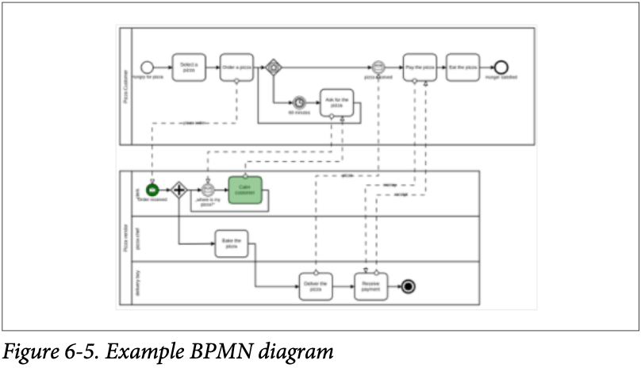

[[section-creating-strategy-patterns]]
== Creating the Strategy Patterns

=== Analysis

==== MECE

"Mutually Exclusive, Collectively Exhaustive". Approach for making lists.

Further reading: https://en.wikipedia.org/wiki/MECE_principle

==== Logic tree

==== Hypothesis

=== World context

==== PESTEL

A PESTEL analysis is a strategic framework commonly used to evaluate the business environment in which a firm operates. Acronym for:

* Political
* Economic
* Social
* Technological
* Environmental
* Legal

Further reading: https://corporatefinanceinstitute.com/resources/knowledge/strategy/pestel-analysis/

==== Scenario Planning
==== Futures funnel
==== Backcasting

=== Industry context

==== SWOT

SWOT is an acronym for Strengths, Weaknesses, Opportunities, and Threats.

Further reading: https://en.wikipedia.org/wiki/SWOT_analysis

==== Porter's Five Forces

Further reading: https://en.wikipedia.org/wiki/Porter%27s_five_forces_analysis

==== Ansoff Growth Matrix

Further reading: https://en.wikipedia.org/wiki/Ansoff_matrix

== Corporate context

=== Stakeholder Alignment

- Determining Stakeholders
- Determining Drivers
- Stakeholder List
- Stakeholder Matrix

=== RACI

RACI - Responsible, Accountable, Consulted, Informed.

- Responsible
These people do the hands-on work to complete this task. Depending on the nature of the items in your work list, this can be any level of title.
- Accountable
These people are answerable to executives for this item being delivered on time with appropriate fitness and quality. May be a VP or director.
- Consulted
These are subject-matter experts on some aspect of the system. They are not directly on the hook for doing the work. They may make local decisions or certain aspects that you seek them out for. They’ll give advice such that their ideas will change your work, the design, or otherwise modify your strategy. Identifying the right Cs on a project is the difference between a lot of buy-in and a robust product, and something more tepid. If you’re mak‐ ing new software, you should likely consult the CISO’s office.
- Informed
This is a one-way street. You update these people on project sta‐ tus, and they don’t have a say or a recommendation about the work you’re doing and can’t change it. This category might include the VP of tax so that he’s aware of your project and can look you up when it’s time to determine if he can apply for an R&D tax credit.

Further reading: https://en.wikipedia.org/wiki/Responsibility_assignment_matrix

=== Life Cycle Stage

=== Value Chain

Further reading: https://en.wikipedia.org/wiki/Value_chain

=== Growth-Share Matrix

Further reading: https://en.wikipedia.org/wiki/Growth%E2%80%93share_matrix

=== Core-Innovation Wave

=== Investment Map

== Department context

=== Principles, Practices, Tools

==== Current and Future Models

==== Sankey Diagrams

Further reading: https://www.sankey-diagrams.com/

==== Business Process Mapping

==== The Law of the Product of Probabilities

=== Application Portfolio Management
